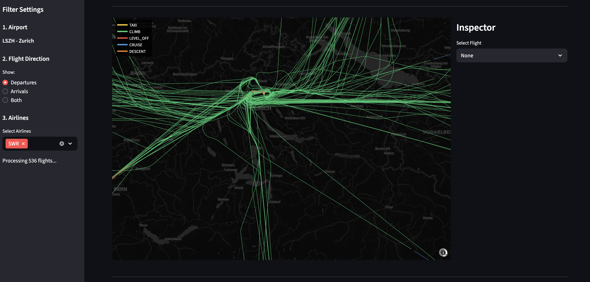
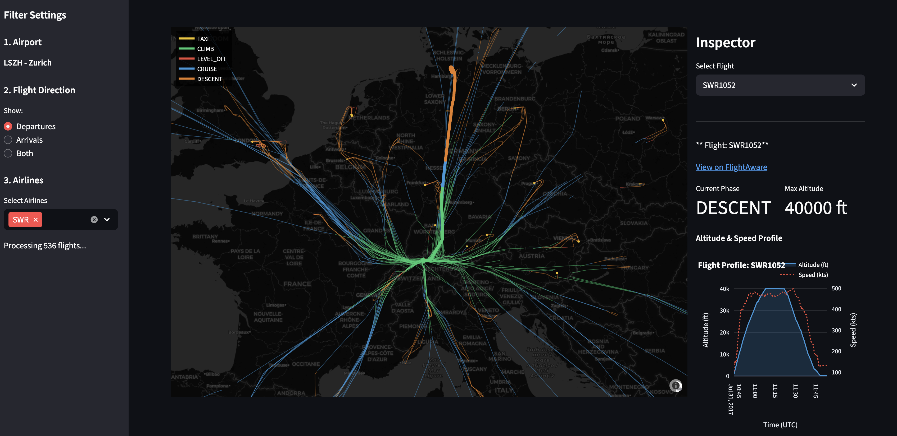
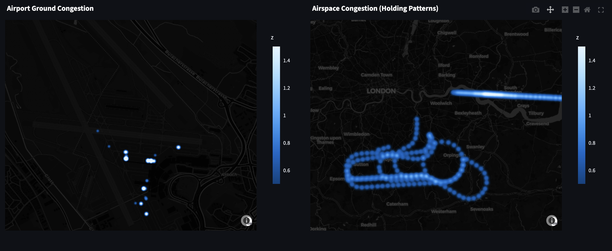

# Aircraft Ops Analytics

    

**Aircraft Ops Analytics** is a data engineering and visualization pipeline designed to analyze airport operational efficiency. It processes unstructured flight telemetry data downloaded from OpenSky Network to uncover insights regarding airspace congestion, taxi times, and flight profiles.

### Repository contents

This repository currently holds two separate things:

1. **The OpenSky/Streamlit application** — complete and documented below. Reads OpenSky `states_*.csv.tar` dumps via `src/convert_to_parquet.py` and serves them through a Streamlit dashboard.
2. **A new ADS-B data engineering pipeline** (`src/adsb/`) — under development, sourced from [adsb.lol globe_history](https://github.com/adsblol/globe_history_2025). It is a different source format and does not share code with the application above. Currently implements raw ingestion and local PySpark processing.

#### Getting the sample data (new pipeline)

Each adsb.lol release is one day of global flight data, ~3.2 GB, published as an uncompressed tar split across two GitHub assets. We do not download a whole one. Because tar is sequential, a byte-range request for a slice of the first part yields whole, valid members — so ingestion locates the `./traces/` region by walking the tar headers, then downloads a small window from it:

```bash
pip install -r requirements-dev.txt
PYTHONPATH=src python -m adsb.ingest
```

This fetches ~8 MB (about 220 aircraft trace files, ~10 s) into `data/raw/adsb/<release-tag>/traces/`, alongside a `manifest.json` recording the exact release, byte range and checksum used. File contents are stored exactly as they appear in the archive — gzipped readsb [trace JSON](https://github.com/wiedehopf/readsb/blob/dev/README-json.md#trace-jsons), unparsed and uncleaned. Only the name gains its true `.gz` suffix, because tools that pick a decompression codec from the suffix (Spark among them) otherwise read the gzip bytes as text.

Use `--tag` for a different day, `--bytes` for a larger sample. `data/` is gitignored, so this step is how you reproduce the dataset locally.

#### Putting it in object storage (new pipeline)

Raw data lives in an S3 bucket, served locally by [MinIO](https://min.io) so the project runs offline with no cloud account. MinIO speaks the S3 API, so the pipeline uses the same `s3a://` Spark connector and the same boto3 client it would use against AWS — there is one implementation, not one per backend.

```bash
docker compose up -d minio
docker compose run --rm spark python -m adsb.upload_raw
```

That creates the bucket if needed and copies the local sample into it, preserving the layout: `data/raw/adsb/<tag>/...` becomes `s3a://adsb/raw/adsb/<tag>/...`. The MinIO console is at http://localhost:9001.

Credentials default to `minioadmin`/`minioadmin` — local dev values, not secrets. Override them (and the bucket) with `S3_ACCESS_KEY`, `S3_SECRET_KEY` and `S3_BUCKET` in a `.env` file.

To run against real AWS S3 instead, drop `S3_ENDPOINT` and supply AWS credentials; no code changes.

#### Processing it with Spark (new pipeline)

PySpark runs in local mode inside its own container — separate from the Streamlit image, which stays Spark-free. It reads the gzipped traces, explodes each aircraft's trace into one row per position report, and aggregates:

```bash
docker compose run --rm spark
```

It reads from `s3a://adsb/raw/adsb` by default (`ADSB_RAW_URI`). Point it at a local directory with `--path data/raw/adsb` — object storage and the local filesystem are the same code path.

#### Bronze Delta table (new pipeline)

Bronze decodes the raw traces into one row per observation and writes them as a [Delta](https://delta.io) table:

```bash
docker compose run --rm spark python -m adsb.bronze
```

It writes `s3a://adsb/bronze/observations` (`ADSB_BRONZE_URI`), then reads the table back and prints its schema and Delta history.

Bronze stays close to the source: nothing is filtered and nothing is corrected — impossible speeds and missing fields are all preserved, because judging them is data quality's job, not Bronze's. The only normalization is technical: decoding the positional trace arrays into typed columns, materializing `event_time` from the day-start epoch plus each point's offset, and splitting altitude's `number | "ground"` union into `altitude_ft` plus an `on_ground` flag. Each row carries `source_file`, `release_tag` and `ingested_at` for lineage.

The table is **not partitioned**. The sample is a single day of ~300k rows (~9 MB across 12 files), so partitioning by date would create exactly one partition and partitioning by aircraft would create 224 tiny ones. Partition by `event_date` once there is more than one day of data.

Run the tests the same way:

```bash
docker compose run --rm spark pytest -q
```

---

### Dashboard Preview



---

## Project Overview

As the aviation industry generates a lot of ADS-B data daily, raw telemetry is often noisy, unstructured, and difficult to query efficiently. This project tries to solve these challenges by implementing a robust **ETL pipeline** and an interactive **analytical dashboard**.

### Key Features

*   **Big Data Processing:** Capable of ingesting and cleaning 24+ hours of global flight data (47M+ rows) into a queryable format.
*   **Physics-Based Data Cleaning:** Custom algorithms filter out sensor glitches, impossible altitudes, and "teleporting" aircraft using velocity and vertical rate sanity checks.
*   **Interactive 4D Map:** High-performance trajectory visualization using **Plotly & Mapbox**, capable of rendering thousands of flights with scroll-to-zoom and click interactions.
*   **Operational KPIs:** Automated calculation of Taxi-Out duration, Holding Patterns (Level-Offs), and Hourly Throughput.
*   **Flight Inspector:** Drill-down capability to visualize specific flight profiles (Altitude vs. Ground Speed over time).

## Scope & Data Limitations

* **Geographic Focus:** While the pipeline is architecture-agnostic, this demonstration is currently configured to analyze operations specifically at **Zurich Airport (LSZH)**.
* **Data Precision:** This project utilizes raw, historical ADS-B state vectors. This data source inherently contains noise, including signal gaps, barometric altitude drift, and sparse ground coverage. While the **Physics Engine** successfully filters out "impossible" movements (glitches), users should treat the metrics as operational estimates rather than forensic-grade flight reconstructions.

## Technical Architecture

The project follows a decoupled architecture separating heavy data processing from the interactive frontend.

*   **ETL Engine:** A standalone Python script that ingests raw `.tar.gz` CSV dumps, validates ICAO airline codes, corrects unit mismatches, and serializes data into **Apache Parquet**.
*   **Optimization Strategy:** Uses **Pushdown Predicates** to load only relevant data slices (e.g., specific airlines) into memory, reducing RAM usage by ~90% compared to standard Pandas loading.
*   **Visualization Layer:** Streamlit interface with vectorized `groupby` operations for real-time analytics.


## Engineering Challenges Solved

This project addresses several real-world data engineering problems:

1.  **Raw Data Quality:** The source data contained mixed hex codes and callsigns in the same column. Implemented a strict Regex validation (`^[A-Z]{3}$`) to isolate valid commercial traffic.
2.  **Sensor Noise:** ADS-B data often contains altitude spikes (e.g., 40k ft jumps in 1s). Implemented a physics engine to discard data points requiring > Mach 1 speed or > 150 ft/s vertical speed.
3.  **Memory Management:** Loading 24h of flight data crashed standard 8GB containers. Implemented Parquet partitioning and lazy loading to keep the app lightweight and fast.
4.  **Rendering Performance:** Plotly struggles with thousands of traces. Implemented **Trace Consolidation** (grouping flights by phase into single API calls) to boost rendering FPS by 100x.

## Installation & Setup

### Prerequisites

1.  **Docker & Docker Compose** installed.
2.  A free **Mapbox Public Access Token** (Get it at [mapbox.com](https://www.mapbox.com)).
3.  Raw flight data from [OpenSky Network](https://opensky-network.org/datasets/states/) (e.g., `states_2017-06-05-00.csv.tar`).

### Quick Start

1.  **Clone the repository:**
    ```bash
    git clone https://github.com/arthurgygax/aircraft-ops-analytics.git
    cd aircraft-ops-analytics
    ```

2.  **Configure Environment:**
    Create a `.env` file in the root directory.
    ```bash
    echo "MAPBOX_TOKEN=pk.eyJ1IjoieW91ci...token_here" > .env
    ```

3.  **Load Data:**
    Download hourly state vectors from OpenSky and place the `.tar` files in `data/raw/`.

4.  **Run the ETL Pipeline:**
    This command spins up a temporary container to clean and convert the data.
    ```bash
    docker-compose run --rm converter
    ```
    *Output: A highly optimized `master_flight_data.parquet` file in `data/processed/`.*

5.  **Launch the Dashboard:**
    ```bash
    docker-compose up app
    ```
    Access the app at **http://localhost:8501**.

## Project Structure

```bash
aircraft-ops-analytics/
├── data/
│   ├── raw/                   # Place downloaded .csv.tar files here
│   └── processed/             # Generated Parquet files live here
├── docker/
│   └── Dockerfile             # Shared image for App and Converter
├── src/
│   ├── adsb/                  # New ADS-B pipeline (adsb.lol source, in development)
│   ├── app.py                 # Main Streamlit dashboard entry point
│   ├── convert_to_parquet.py  # ETL logic & Data Cleaning pipeline
│   ├── logic.py               # Physics filtering & Phase detection algorithms
│   └── viz.py                 # Plotly visualization components
├── tests/                     # Tests for the new pipeline
├── docker-compose.yml         # Service orchestration
├── requirements.txt           # Python dependencies
└── requirements-dev.txt       # Dependencies for running the tests
```

Run the tests for the new pipeline with:

```bash
pip install -r requirements-dev.txt && pytest
```

## Analytics Modules

### 1. Flight Inspector & Profile Analysis
Drill down into individual flights to analyze climb performance. The **Physics Engine** automatically cleans sensor noise to produce accurate Altitude (Blue) vs. Ground Speed (Red) profiles.



---

### 2. Airport Congestion & Ground Radar
A high-resolution density heatmap focuses on ground movements (Taxi phase) to identify taxiway bottlenecks and runway congestion points.



---

### 3. Operational Efficiency Metrics
comparative analysis of airline performance (Taxi Time vs. Volume) and hourly throughput capacity.

## License

Distributed under the MIT License.
