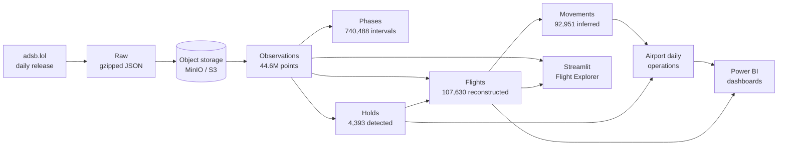

# Aircraft Ops Analytics

**A batch data platform that turns raw ADS-B radio observations into airport
operations analytics — reconstructing flights, detecting flight phases and
holding patterns, and serving the results to an interactive explorer and to
Power BI.**


Nobody publishes an open dataset of "flights that departed airport X today".
What *is* public is the raw radio: hundreds of millions of position reports a
day, broadcast by aircraft and collected by volunteers. This project treats
that as a data engineering problem — take 44 million observations, work out
which aircraft were flying, where they went, what they were doing, and which of
them circled before landing.

---

## Architecture



Six Delta tables, each at a grain nothing else holds. Decoding, cleaning,
deduplication and flight segmentation all happen in one pass, so the point
grain is written once rather than three times; every write is scoped to one
day with `replaceWhere`, so a day can be reprocessed without touching the rest,
and a full rebuild has to be asked for by name.

## What it demonstrates

| | |
|---|---|
| **PySpark** | window functions for segmentation, phase detection and hold geometry; every transformation is Spark-native — no pandas in the pipeline, no row-by-row Python, no UDFs |
| **Delta Lake** | ACID writes, schema enforcement, time travel, partition-scoped overwrite |
| **Object storage** | S3A against MinIO locally; the same code runs against AWS by dropping one environment variable |
| **Docker** | four images — pipeline, app, benchmark, storage — and the whole project runs from `docker compose` |
| **Data modelling** | one table per grain, one key (`flight_id`), no accidental star schema, no layer that only exists because the code once had one |
| **Incremental processing** | day-at-a-time, idempotent, proven against the Delta transaction log; a whole-table overwrite has to be requested explicitly |
| **Data quality** | invariant checks across six tables, run inline by every stage |
| **Analytics** | flight reconstruction, phase detection, holding-pattern geometry |
| **Visualisation** | a Streamlit explorer and a documented Power BI model |

## Quick start

Requires Docker. From a clean checkout:

```bash
# 1. object storage
docker compose up -d minio

# 2. a small real sample: ~8 MB, 224 aircraft, one full day
PYTHONPATH=src python3 -m adsb.ingest
docker compose run --rm spark python -m adsb.upload_raw
docker compose run --rm spark python -m adsb.airports      # airport reference

# 3. the pipeline, in one Spark session
docker compose run --rm spark python -m adsb.run_pipeline \
    --tag v2025.12.30-planes-readsb-prod-0 --full-rebuild

# 4. explore it
docker compose up -d explorer      # http://localhost:8502
```

Each stage prints its row counts and runs its own quality checks. To validate
every table at once:
`docker compose run --rm spark python -m adsb.quality`.

For a bigger sample, `PYTHONPATH=src python3 -m adsb.ingest --bytes 200000000`
(5,073 aircraft) and re-run. Larger runs need more driver heap:
`SPARK_DRIVER_MEMORY=12g docker compose run ...`.

Adding a second day is incremental, not a rebuild — drop `--full-rebuild` and
only that day's partition is replaced:

```bash
TAG=v2025.12.29-planes-readsb-prod-0
PYTHONPATH=src python3 -m adsb.ingest --tag $TAG
docker compose run --rm spark python -m adsb.upload_raw --tag $TAG
docker compose run --rm spark python -m adsb.run_pipeline --tag $TAG
```

A run reclaims its own tombstoned files at the end. Set `ADSB_ROOT` to a
scratch prefix for exploratory runs so they never touch the real tables.

## Key engineering decisions

Full reasoning per stage in [docs/pipeline.md](docs/pipeline.md); these are the
ones that shaped the design.

**Byte-range ingestion instead of downloading a day.** A daily release is
3.2 GB. Because it is an *uncompressed* tar split across GitHub assets, an HTTP
range request for a prefix yields whole, valid members — so the pipeline walks
the tar header chain with 512-byte reads to find where `./traces/` starts
(763 MB in, past a heatmap section) and downloads only what it needs.

**Thresholds are measured, never assumed.** Flights split on a 15-minute
tracking gap because segments containing more than one callsign — the signature
of two flights merged into one — stay flat at 14–19 for thresholds from 5 to 30
minutes, then jump to 47 at 60. The phase level band is ±300 fpm because
airborne vertical rates have a 25th percentile of −640 and a 75th of +512.
Airport matching uses 5 km because segments that began on the ground sit a
median 1.0 km from an airport, and widening to 10 km adds only 1.1%.

**Time windows, not row windows.** Sampling is irregular — median 4 s, mean
8.1 s, p90 20 s. The original OpenSky-era code smoothed over 40 *rows*, which
here would cover 40 seconds for one flight and five minutes for another. Every
window is defined in seconds via `RANGE BETWEEN`.

**Data is validated, not silently repaired.** Coordinate ranges are asserted
rather than corrected: if a future release contains bad positions the pipeline
fails loudly instead of quietly reshaping them. Bad *values* are nulled rather
than their rows dropped, so a glitched speed never costs a valid position fix.

**The partition key comes from the release identity, not the data.** A key
derived from row timestamps would let a stray observation near midnight drag a
neighbouring day into a write, so reprocessing day N could destroy part of day
N−1. Deriving it from the release makes that impossible.

**Scale was measured before optimising.** The pipeline was run at 150× the
development sample (44.4M rows). The small-files problem never materialised and
retrieval stayed fast, so no Z-ordering, clustering or down-sampling was added.
What the scale run *did* surface was Spark's 1 GB default driver heap being
insufficient, and a class of non-aircraft emitters in the data.

## Inferred vs authoritative

This distinction runs through the project, and every table is labelled.

| Authoritative — transmitted by the aircraft | Coverage |
|---|---|
| ICAO address, timestamp, latitude, longitude, ground/airborne flag | 100% |
| Ground speed / track / altitude / vertical rate | 99 / 95 / 88 / 89% |

| Reference lookup — readsb's aircraft database, not transmitted | Coverage |
|---|---|
| Registration, aircraft type | 93 / 92% of flights |
| Registered owner — **the registry owner, not the airline** | 45% |

| Inferred by this pipeline | Coverage |
|---|---|
| Flight boundaries and `flight_id` | all flights |
| Airline code, from an airline-style callsign | 65% |
| Departure / arrival airport, matched geographically | 45 / 42% |
| Flight phases, holding patterns | derived from the trajectory |

**None of this is official.** No flight plan, airline schedule, airport
database or ATC record is involved anywhere. The numbers will not reconcile
with published movement statistics, and every Gold row carries a
`metric_source` or `data_source` column saying so.

## Example questions it answers

- Which airports saw the most inferred movements, and how does traffic
  distribute across the hours of the day?
- Which airlines and aircraft types operate at a given airport?
- What altitude and speed profile did a particular flight fly, and when did it
  climb, cruise and descend?
- Which flights circled before landing, for how long, and how many circuits?
- How does the share of arrivals showing sustained circling differ between
  airports?

On the sample the busiest inferred airports come out as ORD, ATL, AMS, YYZ, DEN
and LAX, with arrivals balancing departures to within a few percent at each —
which nothing in the aggregation enforces.

## The applications

**Flight Explorer** (`docker compose up -d explorer`, port 8502) — filter by
date, airport, airline, aircraft type or callsign; select a flight to see its
trajectory coloured by detected phase, a phase timeline, an altitude/speed
profile and any detected holds; plus an airport view with hourly traffic. It
reads Gold and computes nothing: no Spark, no JVM, starting in seconds via
[delta-rs](https://delta-io.github.io/delta-rs/).

**Power BI** — `docker compose run --rm spark python -m adsb.bi_export` writes
six Parquet extracts (45 MB) that Power BI opens natively.
[docs/powerbi.md](docs/powerbi.md) documents the model, relationships, DAX
measures and dashboard pages.

> **Screenshots:** run the explorer and capture the two tabs into `docs/`. The
> existing `docs/*.png` are from the superseded legacy application and are
> **not** pictures of this app.

## Testing and data quality

```bash
docker compose run --rm spark pytest -q                             # pipeline
docker compose run --rm explorer pytest tests/test_app_data.py -q   # app
```

168 pipeline tests and 19 app tests, covering the places where being wrong is
easy and silent: tar-slice truncation, the deduplication *winner rule* (not just
its row count), segmentation boundaries, phase detection against synthetic
climb/cruise/descent profiles with injected noise, hold geometry against a
synthetic racetrack versus a normal turn, incremental idempotence, the refusal
to overwrite a whole table without being asked, and referential integrity across
every table.

Separately, the data quality checks run **inline in every stage**, so a stage
that produces bad data fails instead of publishing it. They are SQL predicates
matching invalid rows, counted in a single pass, with no framework. Each rule
exists because of a failure mode this pipeline actually showed — and a set of
tests deliberately corrupts data to prove every check fires.

## Limitations

**The sample is not a full day.** The pipeline has been run on 31,387 aircraft
(44.4M observations), roughly half the aircraft in one release: the second
archive part is not yet handled, so absolute counts are about half of full
coverage.

**Coverage is uneven.** adsb.lol sees what its volunteers see — dense over
Europe and North America, thin elsewhere, and patchy on the ground everywhere
(only 44% of flights have any ground observation).

**A flight is an observation artefact.** It is a period of continuous tracking.
A long coverage gap splits one real flight in two; an aircraft tracked through a
turnaround becomes one segment covering two real flights.

**A circle is a circle.** Hold detection finds sustained circling, and survey,
training and police orbits produce identical geometry. On the sample the highest
"hold rates" are at flight-training airports — that is circuit training, not
delay. `hold_rate` is not a delay metric.

**Airports resolve for a minority of flights** — 45% departure, 42% arrival,
both ends for 26%. Those columns are nullable by design.

Per-stage limitations are documented in [docs/pipeline.md](docs/pipeline.md).

## Repository layout

```
src/adsb/            the pipeline, one module per grain
  spark_explore.py   Spark session, trace reader, and the exploration job
  ingest.py          byte-range download from adsb.lol
  upload_raw.py      raw files to object storage
  observations.py    decode, clean, deduplicate and segment -- one pass
  flights.py         the flight table
  airports.py        airport reference, movements, daily operations
  phases.py          climb / cruise / descent / taxi detection
  holds.py           holding pattern detection
  quality.py         data quality checks
  delta_io.py        partitioned writes and the table lifecycle
  bi_export.py       Parquet extracts for Power BI
  run_pipeline.py    the whole pipeline in one Spark session
app/                 Streamlit Flight Explorer (data.py + main.py)
bench/               Spark vs pandas benchmark on the same pipeline
tests/               the test suite
docs/                pipeline, Gold model and Power BI reference
docker/              four images: pipeline, app, benchmark, legacy
```

Reference documentation: [pipeline](docs/pipeline.md) ·
[Gold model](docs/gold-model.md) · [Power BI](docs/powerbi.md)

## Data source

[adsb.lol globe_history](https://github.com/adsblol/globe_history_2025), open
data under the ODbL, collected by volunteer feeders. Airport reference data from
[OurAirports](https://ourairports.com/data/), public domain. Neither is
redistributed here — both are fetched by the pipeline.

<details>
<summary><b>Legacy application</b></summary>

`src/app.py`, `logic.py`, `viz.py` and `convert_to_parquet.py` are the original
project: a single-airport Streamlit dashboard over OpenSky CSV dumps that
computed flight phases in the browser at query time. It is kept for reference
and superseded by the pipeline and Flight Explorer above. It is excluded from a
default `docker compose up`; run it with
`docker compose --profile legacy up app` (needs a `.env` with a Mapbox token).
The screenshots in `docs/` are of that application.

</details>

## License

MIT.
